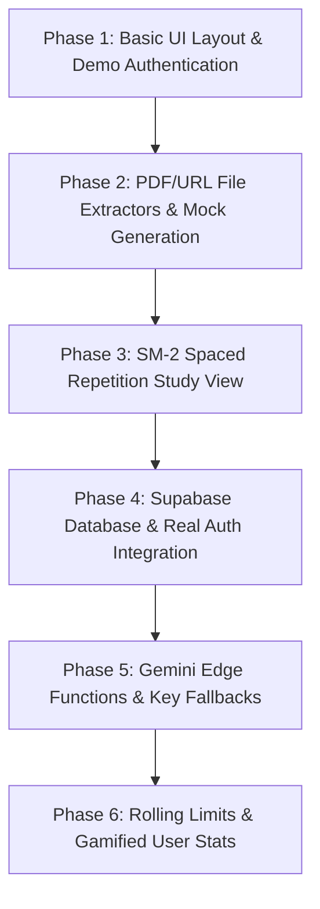

# ⚡️ Flick ⚡️ — Developer Roadmap & Feature Overview

Welcome! This guide is designed for beginners who want to understand the architecture, database schema, codebase, and features of the **Flick** application. Flick is a modern, gamified spaced repetition flashcard study application powered by Google Gemini AI.

This document breaks down every feature in detail, explains how it works, links to the relevant code files, and outlines a step-by-step roadmap showing how the project is built.

---

## 🏗️ 1. Architecture Overview

Flick is structured as a modern full-stack monorepo consisting of:

1. **Frontend (React 19 SPA)**: Located in the [`/frontend`](file:///c:/Users/ATHARVA/Desktop/Flick/frontend) directory. Built using **TypeScript** for safety, **Vite** for fast bundling, **TailwindCSS** for UI layout styling, and **Framer Motion** for premium transitions.
2. **Backend (Supabase Edge Functions)**: Built using **Deno** and located in [`/backend`](file:///c:/Users/ATHARVA/Desktop/Flick/backend). It serves lightweight edge endpoints (e.g., calling Gemini models securely without exposing developer keys on the frontend client).
3. **Database (PostgreSQL)**: Maintained in Supabase. The schema is defined in [`/database/schema.sql`](file:///c:/Users/ATHARVA/Desktop/Flick/database/schema.sql).

---

## 🗄️ 2. Database Schema Definition

Flick uses three primary relational tables in PostgreSQL:

### A. Decks Table (`decks`)
Decks act as folders containing collections of flashcards.
* **`id`** (UUID): Unique primary key.
* **`user_id`** (UUID): Connects the deck to the owning user.
* **`title`** (Text): Name of the deck.
* **`source_type`** ('text' | 'pdf' | 'url'): Type of source content used to create the cards.
* **`source_preview`** (Text): A short preview snippet of the source file/text.
* **`card_count`** (Integer): The count of cards in the deck.

### B. Cards Table (`cards`)
The individual flashcards with active review statistics for spaced repetition.
* **`id`** (UUID): Primary key.
* **`deck_id`** (UUID): Foreign key linking back to the parent deck.
* **`user_id`** (UUID): Owner ID.
* **`front`** (Text): The prompt or question.
* **`back`** (Text): The short core answer.
* **`explanation`** (Text): Contextual explanation shown after a user flips the card.
* **`hint`** (Text): Extra clue.
* **`next_review`** (Date): The date the card should next be reviewed (defaults to today).
* **`interval_days`** (Integer): Current spaced repetition interval (wait days before showing the card again).
* **`ease_factor`** (Numeric): Card-specific difficulty multiplier (starts at 2.5).
* **`repetitions`** (Integer): Successive correct review count.

### C. User Stats Table (`user_stats`)
For gamification elements.
* **`streak`** (Integer): Number of consecutive days the user has studied.
* **`xp`** (Integer): Cumulative experience points earned.
* **`total_cards_studied`** (Integer): Metric of total card reviews.
* **`last_study_date`** (Date): The date the user last reviewed a card (used to compute streaks).

---

## 🎨 3. Core Features & Code Implementations

Let's look at how each feature was implemented under the hood.

### 🔑 A. Dual-Mode Authentication & User Profiles
To allow developers and guests to test the app without setting up Supabase, Flick supports both **Demo Mode** (local browser storage) and **Supabase Mode** (real database).

* **How it works**: The central auth state is managed by the custom React hook [`useAuth.ts`](file:///c:/Users/ATHARVA/Desktop/Flick/frontend/src/hooks/useAuth.ts).
* **Implementation detail**:
  - `isDemoMode` is read from [supabase.ts](file:///c:/Users/ATHARVA/Desktop/Flick/frontend/src/lib/supabase.ts). If set to `true`, the application stores simulated user credentials (`Alex Dev`) and user stats directly in `localStorage` under keys `flick_demo_user` and `flick_demo_stats`.
  - In Production mode, it communicates with Supabase Auth (`supabase.auth.getSession()` and `supabase.auth.onAuthStateChange()`) to listen for OAuth/Google authentication flows and fetches stats from the `user_stats` table.

---

### 🤖 B. AI Flashcard Constructor
The card constructor is the core AI-generation pipeline. Users can input content in three ways in the [`GenerateForm.tsx`](file:///c:/Users/ATHARVA/Desktop/Flick/frontend/src/components/features/GenerateForm.tsx) panel:

1. **Text**: Pasting plain text notes.
2. **PDF Extractor**: Direct file upload. The app extracts text using the **PDF.js** library worker:
   ```typescript
   const arrayBuffer = await file.arrayBuffer();
   const pdf = await pdfjsLib.getDocument({ data: arrayBuffer }).promise;
   // Loop pages and extract text content items using page.getTextContent()
   ```
3. **URL Reader**: Pastes a website URL. Flick prepends `https://r.jina.ai/` to the user's URL. This queries the **Jina Reader API**, which scrapes the web page and returns it as clean, readable markdown.

* **API Client & Quota Handling**:
  The generation requests go through [`generateCards` in gemini.ts](file:///c:/Users/ATHARVA/Desktop/Flick/frontend/src/lib/gemini.ts).
  - If a user-provided custom API key is configured (saved in local storage), Flick sends a direct `POST` query to the client-side Google Gemini or Groq API endpoints.
  - If no custom key is provided, it attempts to route the request through the Supabase Edge Function [`generate-cards`](file:///c:/Users/ATHARVA/Desktop/Flick/backend/functions/generate-cards/index.ts) using the shared project keys.
  - **Count Normalization**: To prevent the AI from returning an incorrect number of cards, the response is filtered through `adjustCardCount`. It slices the array if the LLM generates too many cards, and duplicates/pads cards (with a `(Recall Practice)` notice) if it generates fewer than requested.

---

### 🧠 C. Spaced Repetition (SM-2 Algorithm)
Flick schedules study card reviews using the **SuperMemo SM-2 algorithm**, implemented in [`sm2.ts`](file:///c:/Users/ATHARVA/Desktop/Flick/frontend/src/lib/sm2.ts).

* **The Algorithm Rules**:
  - The user reviews a card and grades their recall on a scale of **0 to 3**:
    - `0`: Again (Forgotten)
    - `1`: Hard (Partially remembered)
    - `2`: Good (Correct response)
    - `3`: Easy (Perfect recall)
  - **Ease Factor (EF)** is adjusted dynamically:
    $$\text{New EF} = \text{EF} + \left(0.1 - (3 - \text{Quality}) \times (0.08 + (3 - \text{Quality}) \times 0.02)\right)$$
    The minimum allowed Ease Factor is restricted to `1.3` to avoid intervals stalling.
  - **Intervals (`I`)** (days to wait before the next review) are determined by repetitions:
    - Repetitions = 0 (Quality < 1): Reset interval to `1` day and set repetitions back to `0`.
    - Repetitions = 1 (First correct review): Show card in `1` day.
    - Repetitions = 2 (Second correct review): Show card in `6` days.
    - Repetitions > 2 (Ongoing mastery): Multiply the previous interval by the new Ease Factor:
      $$\text{New Interval} = \text{Round}(\text{Interval} \times \text{Ease Factor})$$

---

### 📊 D. Daily Streaks & XP Rewards
To maintain user engagement, Flick rewards study habits:
* XP is awarded upon completing card reviews.
* A streak counter tracks daily consistency. In [`useAuth.ts`](file:///c:/Users/ATHARVA/Desktop/Flick/frontend/src/hooks/useAuth.ts), when a study session occurs, it compares the current date with the `last_study_date`:
  - If the user studied **yesterday**, the streak increases by `1`.
  - If the user studied **today**, the streak remains active.
  - If more than 24 hours have passed since yesterday, the streak resets to `1`.

---

### ⏱️ E. Card Generation Rate Limits
To prevent spam, Flick enforces a rolling **12-hour limit** of **100 cards** per user:
* Managed globally via [`CardUsageContext.tsx`](file:///c:/Users/ATHARVA/Desktop/Flick/frontend/src/context/CardUsageContext.tsx).
* When a deck is generated, the card count is logged in a history array:
  `{ count: 10, timestamp: "2026-06-29T21:40:00Z" }` stored in the user's `localStorage` under `flick_generation_history_${user.id}`.
* A filter removes records older than 12 hours. The sum of the remaining active entries represents `cardsUsed`.
* The progress bar in the [Navbar](file:///c:/Users/ATHARVA/Desktop/Flick/frontend/src/components/layout/Navbar.tsx) displays the percentage of allocated cards remaining.

---

## 📈 4. Developer Step-by-Step Roadmap

For a beginner rebuilding this application from scratch, follow this step-by-step roadmap:



### Phase 1: Set up Project Foundation & Mock Authentication
* **Goal**: Initialize the folder structure and configure the local developer workspace.
* **Steps**:
  1. Initialize the monorepo using Vite, React, and TypeScript. Install TailwindCSS.
  2. Implement local authentication mocking (Demo Mode) so the app runs out-of-the-box without needing databases. Define the `useAuth` hook structure.
  3. Create core layout templates: the [Landing page](file:///c:/Users/ATHARVA/Desktop/Flick/frontend/src/pages/Landing.tsx) and the [DashboardLayout](file:///c:/Users/ATHARVA/Desktop/Flick/frontend/src/components/layout/DashboardLayout.tsx).

### Phase 2: Implement Client-Side File Extraction
* **Goal**: Extract text from notes, uploaded files, and URLs.
* **Steps**:
  1. Add PDF parsing using the CDN version of `pdfjs-dist` inside a file handler.
  2. Setup Jina AI Reader API integration to parse plain text out of any article link.
  3. Formulate the fallback mock card constructor in `gemini.ts` to generate dummy QA cards based on string search rules if no API key is specified.

### Phase 3: Build the Card Study Session & SM-2 Engine
* **Goal**: Enable flashcard review logic.
* **Steps**:
  1. Build the card flip interface ([FlipCard.tsx](file:///c:/Users/ATHARVA/Desktop/Flick/frontend/src/components/ui/FlipCard.tsx)) with a 3D perspective flip CSS animation.
  2. Implement the SM-2 algorithm in `sm2.ts` to calculate intervals.
  3. Build the [`StudyMode.tsx`](file:///c:/Users/ATHARVA/Desktop/Flick/frontend/src/components/features/StudyMode.tsx) page which cycles through due cards, records ratings (0–3), and updates intervals.

### Phase 4: Database Integration & Persistent Storage
* **Goal**: Persist decks and cards.
* **Steps**:
  1. Create a Supabase project and run the SQL queries in [`schema.sql`](file:///c:/Users/ATHARVA/Desktop/Flick/database/schema.sql) to set up tables and triggers.
  2. Write Custom database hooks: [`useDecks.ts`](file:///c:/Users/ATHARVA/Desktop/Flick/frontend/src/hooks/useDecks.ts) and [`useCards.ts`](file:///c:/Users/ATHARVA/Desktop/Flick/frontend/src/hooks/useCards.ts). These fetch and write directly to Supabase tables.

### Phase 5: Integrate Gemini AI & Quota Fallbacks
* **Goal**: Connect live AI engines to the card generator.
* **Steps**:
  1. Deploy the Deno Edge Function `generate-cards` to Supabase to handle safe backend requests to Google's Gemini models.
  2. Build settings form panels ([Settings.tsx](file:///c:/Users/ATHARVA/Desktop/Flick/frontend/src/pages/Settings.tsx)) allowing students to save their own Gemini / Groq API keys locally if shared quotas are hit.
  3. Apply count normalization (`adjustCardCount`) to guarantee returned decks match requested counts.

### Phase 6: Add Gamification & Limit Counters
* **Goal**: Implement rolling limit checks and user reward statistics.
* **Steps**:
  1. Implement `CardUsageContext` to enforce rolling 12-hour limit ceilings.
  2. Create streak check routines and XP modifiers in `useAuth.ts` stats.
  3. Design visual charts ([StatsBar.tsx](file:///c:/Users/ATHARVA/Desktop/Flick/frontend/src/components/features/StatsBar.tsx)) displaying cumulative user accomplishments.
